# APOTEKH User Manual

Cloud-based, offline-first Pharmacy Management System and digital health ecosystem for Tanzanian retail pharmacies, ADDOs, wholesale distributors, pharmacy owners, and healthcare partners.

Audience:

- Sales and marketing team: use this manual to demo the platform, answer product questions, and explain the rollout story.
- End users: pharmacists, dispensers, Pharmacists In Charge, owners, cashiers, wholesale staff, and delivery staff.
- Investors and partners: use this manual to understand feature depth, workflow maturity, and Tanzania-specific product differentiation.

Availability note:

- Implemented features are described as current product workflows.
- Items marked "Coming Soon" or "Deferred" are visible in the product or website but are not full operational workflows yet.
- Current subscription pricing is published in the pricing matrix below and in `Settings > Subscription`.

---

## 1. Welcome to APOTEKH

### What is APOTEKH?

APOTEKH is an offline-first pharmacy operating system for Tanzania that connects dispensing, inventory, compliance, safety alerts, analytics, wholesale workflows, and professional learning in one platform.

### Key benefits

- Cloud plus offline operation: continue key inventory and dispensing work during unstable internet, then sync when connectivity returns.
- Pharmacy-specific workflows: batch tracking, expiry monitoring, FEFO support, stock movements, controlled-drug registers, and daily close reporting.
- Patient safety at the counter: drug interaction checks, contraindication alerts, pregnancy, breastfeeding, renal, hepatic, allergy, and NCD-related prompts.
- Regulatory readiness: compliance tracker, TMDA inspection checklist, staff credential tracking, source updates, TMDA Updates, and Tanzania-focused master data.
- Tanzania context: TMDA registration fields, NEMLIT and MSD catalogue references, AWaRe antibiotic flags, NHIF and ADR workflows on the roadmap.
- Growth platform: analytics, forecasting preview, B2B wholesale workflows, Knowledge Hub, CPD tracking, and founder controls.

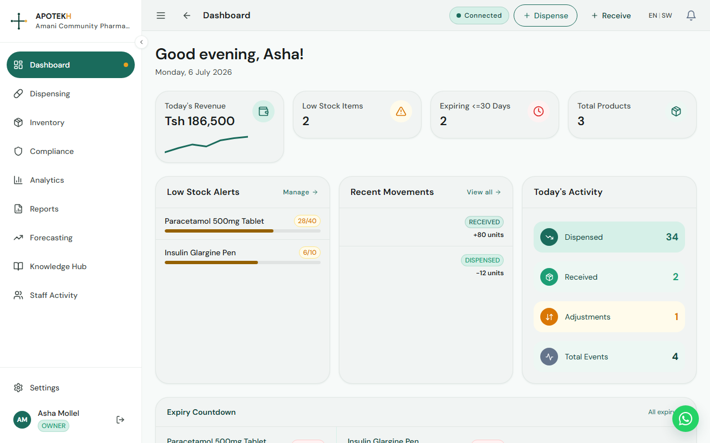

### Who uses APOTEKH?

- `OWNER`: manages pharmacy operations, subscription, team, analytics, reports, stock decisions, and business oversight.
- `PHARMACIST_IN_CHARGE`: oversees clinical safety, compliance, staff work, stock corrections, PIC PIN overrides, and dispensing quality.
- `DISPENSER`: handles daily dispensing, stock intake, inventory updates, order preparation, and compliance tasks where allowed.
- `CASHIER`: supports dispensing and reports with limited operational access.
- `WHOLESALE_MANAGER`: manages wholesale dashboard, orders, catalogue, invoices, receivables, and supplier operations.
- `WHOLESALE_COUNTER_STAFF`: supports wholesale order picking, verification, and counter workflow.
- `DELIVERY_STAFF`: supports wholesale delivery confirmation and delivery tasks.
- `SUPER_ADMIN`: founder/platform control role with access to founder dashboards, source updates, and cross-platform administration.

---

## 2. Getting Started

### Sign-up and pharmacy registration

Where to find it: `/register`

Who uses it: new pharmacy owners or administrators.

What it does:

The registration page creates the first pharmacy account and the owner/admin login. The form captures pharmacy details and the first administrator account.

Registration fields include:

- Pharmacy Name
- Pharmacy Type: `RETAIL`, `WHOLESALE`, `RETAIL_WHOLESALE`, or `ADDO`
- Region
- Address
- Owner/Admin first name and last name
- Email address
- Password and confirmation

Typical scenario:

1. Open the registration page.
2. Enter the pharmacy name, region, address, and pharmacy type.
3. Enter owner/admin account details.
4. Submit the form.
5. APOTEKH sends an email verification flow when configured by the backend.

### Email verification

Where to find it:

- `/auth/check-email`
- `/auth/verify-email?token=...`

Who uses it: the registering owner/admin.

What it does:

After registration, the user checks their email and opens the verification link. The verification page validates the token, signs the user in, stores authentication, selects the pharmacy, and moves the user to the 14-day trial confirmation page.

If the link is invalid or expired, the page shows an error and directs the user to register again.

### 14-day trial overview

Where to find it: `/auth/trial-confirmed`, Dashboard trial banner, and `Settings > Subscription`

Who uses it: owners, super admins, and users during onboarding.

What it does:

Every newly registered pharmacy enters a 14-day trial. The trial confirmation screen highlights included capabilities:

- Full dispensing workflow
- Inventory and batch tracking with FEFO support
- Drug interaction and safety alerts
- Analytics and financial reports
- Knowledge Hub and TMDA updates
- Compliance tracker and staff credentials

Trial behavior:

- Trial countdown appears in the app when relevant.
- If a trial ends, access is paused except for allowed subscription and read-only exceptions.
- Owners and super admins can open subscription options and contact the founder for renewal or upgrade.

### Choosing a subscription tier

Where to find it: `Settings > Subscription`

Who uses it: `OWNER`, `SUPER_ADMIN`

What it does:

The Subscription page shows current tier, billing cycle, trial status, trial countdown, manual payment instructions, payment method setup, and upgrade contact options.

Known tier names in the platform:

- `ADDO`
- `BASIC`
- `STANDARD`
- `PREMIUM`
- `WHOLESALE`
- `ENTERPRISE`

Current pricing:

**Retail tiers:**

| Plan | Monthly price | Annual price | Included scale |
|---|---:|---:|---|
| ADDO | Tsh 20,000 | Tsh 200,000 | 1 outlet, 3 users |
| BASIC | Tsh 39,000 | Tsh 390,000 | 2 outlets, 5 users |
| STANDARD | Tsh 55,000 | Tsh 550,000 | 3 outlets, 10 users |
| PREMIUM | Tsh 75,000 | Tsh 750,000 | 5 outlets, 20 users |

**Wholesale / distributor tiers:**

| Plan | Monthly price | Annual price | Included scale |
|---|---:|---:|---|
| WHOLESALE | Tsh 100,000 | Tsh 1,000,000 | 1 wholesale outlet, 10 users + delivery staff |
| ENTERPRISE | Custom | Custom | 6+ outlets, unlimited users |

Annual billing is 10x the monthly price. Enterprise pricing is negotiated for custom rollout, reporting, and governance needs.

### First login and pharmacy setup

Where to find it:

- `/login`
- `/select-pharmacy`
- `Settings > Profile`
- `Settings > Team`
- `Settings > Subscription`
- `Compliance`
- `Inventory`

What to do after first login:

1. Verify that the correct pharmacy is active.
2. If the user has multiple pharmacy memberships, choose the active outlet in Outlet Selection.
3. Review pharmacy information in `Settings > Profile`.
4. Add team members in `Settings > Team`.
5. Configure dispensing payment methods in `Settings > Subscription`.
6. Add compliance items such as licences, insurance, equipment checks, and staff credentials.
7. Add or import products, then receive stock batches.

Important pharmacy data in the backend includes:

- `licenceNumber`
- `region`
- `pharmacyType`
- `subscriptionTier`
- `billingCycle`
- `status`
- `timezone`, defaulting to `Africa/Nairobi`
- `vfdEnabled`
- `userLimit`

---

## 3. Dashboard & Navigation

### Main dashboard

Where to find it: `Dashboard`

Who uses it: all signed-in users with access to the active pharmacy.

What it does:

The Dashboard gives a daily operating snapshot. It greets the user, shows the date, and provides quick actions for `Dispense` and `Receive Stock`.

Main widgets include:

- Total Products
- Low Stock Items
- Expiring <=30 Days
- Low Stock Alerts
- Recent Movements
- Today's Activity
- Expiry Countdown

Typical scenario:

1. A PIC logs in at the start of the day.
2. They check expiring batches and low-stock alerts.
3. They open Inventory or Receive Stock directly from the dashboard.
4. They review recent stock movements and today's dispensing activity.

### Sidebar navigation

The main sidebar includes these active and visible sections depending on role:

- `Dashboard`
- `Knowledge Hub`
- `TMDA Updates`
- `Inventory`
- `Order Preparation`
- `Compliance`
- `Analytics`
- `Dispensing`
- `Safety Alerts`
- `Controlled Register`
- `Wholesale`
- `Orders`
- `Reports`
- `Attendance`
- `Sync Conflicts`
- `Founder`
- `Settings`

Coming Soon sidebar items include:

- `CPD Tracker`
- `NHIF Claims`
- `PC-Accredited CPD`
- `Stock Exchange`
- `TMDA Reporting`
- `ADR Reporting`
- `Patient App`
- `AI Safety`
- `Data Products`

Some of these have working pages, while others intentionally show deferred feature pages or waitlist forms.

### Top bar

The top bar includes:

- Back button
- Page title where available
- Active pharmacy outlet selector for users with multiple memberships
- Connectivity status: `Synced`, `Offline`, or pending sync count
- Quick actions: `Dispense` and `Receive`
- Notification bell

### Role-based views

Navigation and API permissions are role-aware.

Examples:

- `SUPER_ADMIN` can access founder controls and platform-level admin views.
- `OWNER` can manage subscription, team, reports, stock, wholesale, and compliance.
- `PHARMACIST_IN_CHARGE` can manage dispensing safety, compliance, stock adjustments, team-related workflows, and reports.
- `DISPENSER` can dispense, receive stock, manage some inventory, submit stock adjustment suggestions, and use assigned workflows.
- `CASHIER` can access dispensing and financial reports where permitted.
- Wholesale roles see wholesale-specific dashboards, orders, picking, and delivery workflows.

---

## 4. Inventory Management

### Inventory dashboard

Where to find it: `Inventory`

Who uses it: `OWNER`, `PHARMACIST_IN_CHARGE`, `DISPENSER`, wholesale inventory roles, `SUPER_ADMIN`

What it does:

The Inventory page summarizes stock health and provides links to all inventory tasks.

Buttons and pages include:

- `Receive Stock`
- `Adjust Stock`
- `Products`
- `Import Catalogue`
- `Drug Catalogue`
- `Batches`
- `Conflicts`

Dashboard cards show:

- Total SKUs
- Total Units
- Low Stock
- Expiring <=30d
- Low Stock Items
- Expiring Soon

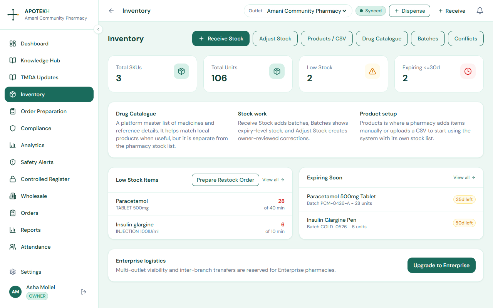

### Product catalogue

Where to find it:

- `Inventory > Products`
- `Inventory > Add Product`
- `Inventory > Edit Product`

Who uses it: inventory managers, PICs, dispensers where allowed, owners.

What it does:

Products is the pharmacy's local stock catalogue. It is different from the system-wide Drug Catalogue. Local products are what staff search, receive, and dispense.

Product fields include:

- Generic Name
- Brand / Trade Name
- Product Name
- Manufacturer
- Therapeutic Category
- Drug Class: `OTC`, `PRESCRIPTION`, `CONTROLLED`, `NARCOTIC`
- SKU / Item Code
- Barcode
- TMDA Registration No.
- Description
- Dosage Form
- Strength
- Unit of Measure
- Pack Size
- Storage Condition
- Default Purchase Price
- Selling Price
- Reorder Level
- Minimum Stock

Typical scenario:

1. Open `Inventory > Products`.
2. Search by name, generic name, barcode, or SKU.
3. Open an existing item or click `Add Product`.
4. Fill required product details.
5. Save, then receive stock batches for that product.

### Drug Catalogue

Where to find it: `Inventory > Drug Catalogue`

Who uses it: pharmacists, PICs, owners, dispensers creating cleaner products.

What it does:

Drug Catalogue is the system-wide medicine reference list. It is not the pharmacy's current stock list. It helps staff search official/reference product names, generic names, brands, manufacturers, TMDA numbers, storage condition, and NEML status.

Search and filters include:

- Drug name
- Brand
- Manufacturer
- MSD/TMDA number
- Storage condition: Ambient, Refrigerated, Frozen
- `NEML only`

Typical scenario:

1. Search for a medicine in `Drug Catalogue`.
2. Confirm form, strength, pack, storage, registration, and flags.
3. Use the match when creating or receiving a local product.

### Catalogue import from supplier PDFs

Where to find it: `Inventory > Import Catalogue`

Who uses it: owners, PICs, dispensers managing product setup.

What it does:

Import Catalogue lets a user upload a supplier PDF, extract medicine rows using AI-assisted catalogue import, review the rows, skip duplicates, and save selected products into inventory.

Typical scenario:

1. Open `Inventory > Import Catalogue`.
2. Upload a supplier PDF.
3. Review extracted rows for product name, generic name, brand, strength, dosage form, manufacturer, pack size, and TMDA registration number.
4. Remove bad rows or edit fields.
5. Save products to inventory.

Availability note:

The backend warns if `ANTHROPIC_API_KEY` is not configured. In that case, AI catalogue import may be unavailable.

### Batch management and FEFO

Where to find it:

- `Inventory > Batches`
- `Inventory > Expiry Dashboard`
- `Inventory > Receive Stock`
- Product detail views

Who uses it: PICs, dispensers, inventory managers, owners.

What it does:

APOTEKH tracks stock at batch level. Each batch stores:

- Product
- Batch number
- Expiry date
- Quantity remaining
- Purchase price
- Supplier
- Received date

FEFO means First Expiry, First Out. APOTEKH supports FEFO by making expiry and batch-level quantities visible and by using batch-aware stock movements during dispensing and receiving.

Typical scenario:

1. Open `Inventory > Batches`.
2. Search by product or batch number.
3. Review quantity remaining and expiry status.
4. Use `Expiry Dashboard` to prioritize batches expiring soon.

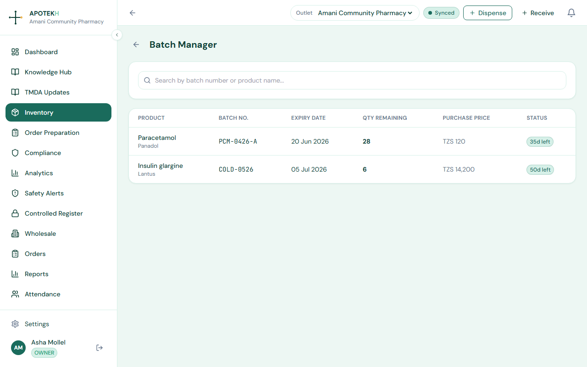

### Stock intake

Where to find it: `Inventory > Receive Stock`

Who uses it: dispensers, PICs, owners, wholesale managers where allowed.

What it does:

Receive Stock records incoming medicines into batches. It supports product search, barcode lookup, system master catalogue matching, supplier selection, batch details, pack-price conversion, selling price update, and offline queueing.

Stock intake methods:

- Search local products.
- Use the system master catalogue to create a local product.
- Scan or manually enter a barcode.
- Add one line or multiple lines to an intake cart.
- Receive all items together.

Barcode behavior:

- Camera scanning uses the device camera when supported.
- Manual barcode entry is available for keyboard scanners or typed codes.
- Barcode lookup checks local mappings, user mappings, GS1-style data where available, and misses.
- If no product is matched, staff can search manually and save a barcode mapping.

Typical scenario:

1. Open `Inventory > Receive Stock`.
2. Select supplier for the receipt, if known.
3. Search or scan the product.
4. Select a local product or create one from master catalogue.
5. Enter batch number, expiry date, quantity, purchase price, and optional selling price.
6. Add to cart.
7. Repeat for other products.
8. Click `Receive all`.

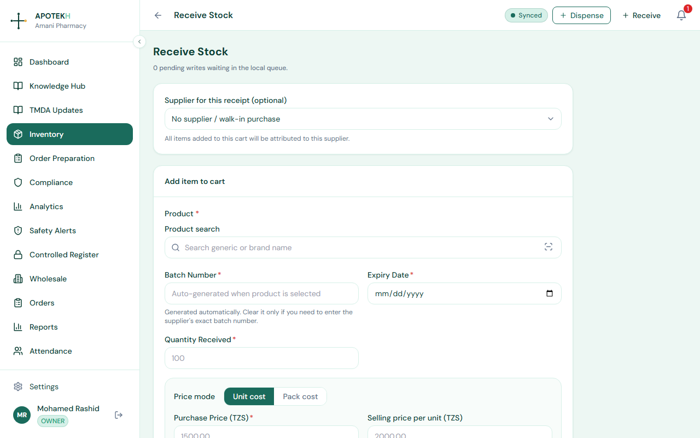

Offline behavior:

- If offline, batch writes are queued in IndexedDB.
- The top bar shows pending sync count.
- When connection returns, queued writes sync automatically.
- Rejected writes become inventory conflicts where possible.

### Stock adjustments and photo evidence

Where to find it: `Inventory > Adjust Stock`

Who uses it:

- `DISPENSER`: submits stock adjustment suggestions.
- `OWNER`, `PHARMACIST_IN_CHARGE`, `SUPER_ADMIN`: submit and review adjustment requests.

What it does:

Stock adjustments are handled as requests with an approval trail. Dispensers do not directly change stock. They submit a suggestion with product, optional batch, quantity delta, reason, note, and optional photo evidence.

Reasons include:

- Count variance
- Damaged stock
- Expired stock
- Return to supplier
- Found stock / increase
- Other

Typical scenario:

1. A dispenser finds damaged stock.
2. They open `Inventory > Adjust Stock`.
3. They search the product, select a batch if needed, enter a negative quantity delta, choose `DAMAGED`, add a note, and attach a photo.
4. The PIC opens the pending owner review section.
5. The PIC approves, partially approves, or rejects the request.
6. Approved changes apply stock movement and preserve audit context.

### Expiry dashboard and automatic alerts

Where to find it:

- `Inventory > Expiry Dashboard`
- Dashboard `Expiry Countdown`
- Analytics `Expiry Risk`

Who uses it: owners, PICs, dispensers, compliance users.

What it does:

Expiry views help staff identify batches expiring soon. Dashboard and analytics views highlight 30-day risk; analytics includes wider risk windows such as 1, 7, 30, 60, and 90 days.

Backend jobs include expiry alert generation, low-stock alerts, compliance alerts, and weekly digest jobs.

### Order Preparation

Where to find it: `Order Preparation`

Who uses it: `OWNER`, `PHARMACIST_IN_CHARGE`, `DISPENSER`, `WHOLESALE_MANAGER`, `SUPER_ADMIN`

What it does:

Order Preparation helps teams create stock orders from low-stock suggestions or manual product search. Orders can be drafts, submitted, partially received, received, or cancelled.

Typical scenario:

1. Open `Order Preparation`.
2. Click `New Order`.
3. Search inventory or add low-stock suggestions.
4. Enter quantity, expected unit cost, supplier, notes, expected delivery, and order notes.
5. Save draft or submit order.
6. When stock arrives, open the order and receive items with batch number, expiry date, quantity received, unit cost, and selling price.

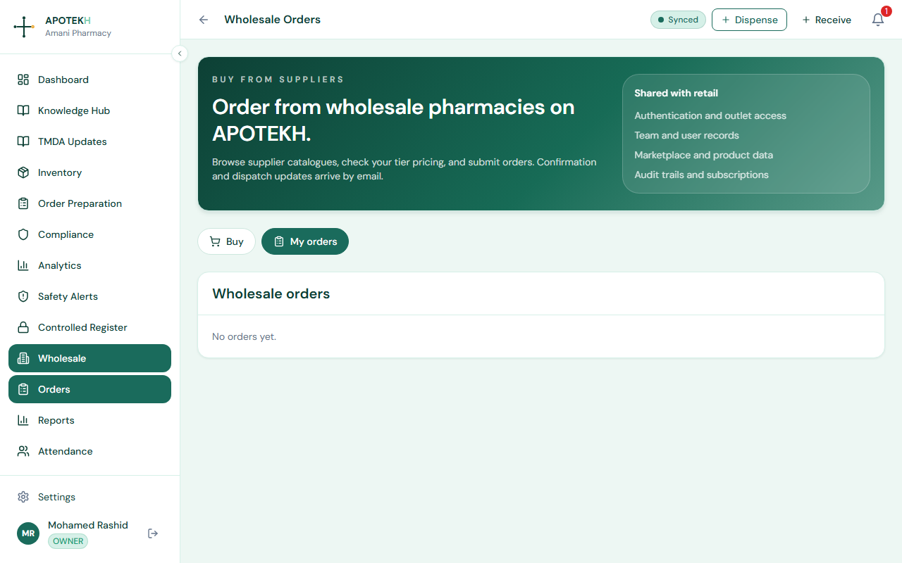

### Sync Conflicts

Where to find it: `Sync Conflicts` or `Inventory > Conflicts`

Who uses it: `OWNER`, `PHARMACIST_IN_CHARGE`, `SUPER_ADMIN`

What it does:

Sync Conflicts shows queued local writes and server conflicts created after offline sync rejection. Staff can review local payloads, server responses, and resolve open conflicts.

---

## 5. Dispensing & Point-of-Sale

### Dispensing screen

Where to find it: `Dispensing`

Who uses it: `PHARMACIST_IN_CHARGE`, `DISPENSER`, `CASHIER`, `SUPER_ADMIN`

What it does:

The Dispensing screen is the main point-of-sale workflow. It combines patient context, medicine search, safety checks, basket management, payment method selection, optional prescription photo, discount controls, and receipt output.

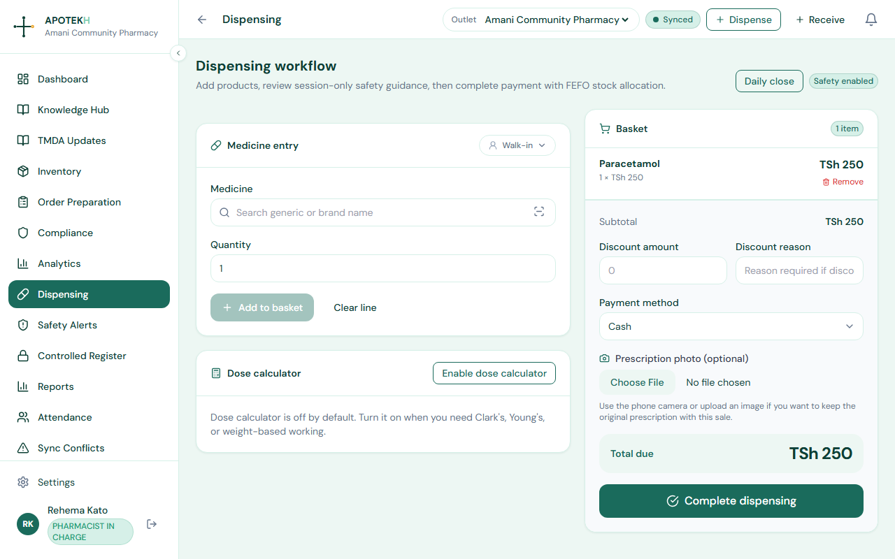

### Step-by-step dispensing flow

1. Open `Dispensing`.
2. Choose walk-in customer or enter patient/customer context.
3. Add optional patient details:
   - Phone
   - Age
   - Weight
   - Diagnoses
   - Allergies
   - Pregnant
   - Breastfeeding
   - Renal impairment
   - Hepatic impairment
4. Search medicine by product name, generic name, barcode, or SKU.
5. Select the medicine and review stock.
6. Enter quantity.
7. Add counselling notes if needed.
8. Click `Add to basket`.
9. Review patient safety alerts.
10. If a PIC override is required, enter override reason and PIC PIN.
11. Select payment method.
12. Enter payment reference if the method requires it.
13. Attach a prescription photo if needed and online.
14. Click `Complete dispensing`.
15. Download or review the receipt.

Current payment methods include:

- `CASH`
- `MPESA`
- `TIGOPESA`
- `AIRTEL_MONEY`
- `HALOPESA`
- `INSURANCE`

Owners can configure mobile money payment details from `Settings > Subscription`.

### Batch picking and FEFO

Dispensing is stock-aware and batch-aware in the backend. The app prevents dispensing more units than available. Product and batch records preserve stock movement history, and FEFO support is available through batch expiry views and backend stock allocation.

If staff need to inspect batch-level stock before dispensing, use `Inventory > Batches` or the product detail view.

### Offline dispensing

Offline dispensing is supported for core checkout without prescription photo upload.

What works offline:

- Add products to basket using cached/searchable product data already available to the browser.
- Complete a dispensing session.
- Queue the transaction locally.
- Apply local inventory deltas so stock shown on the device reflects the queued sale.
- Sync automatically when connection returns.

What does not work offline:

- Prescription photo upload requires a network connection before checkout.
- Server-only safety checks may be unavailable if not already fetched.
- Fresh product search depends on cached reads and available local data.

What happens when the device reconnects:

1. The queued dispensing session is posted to `/dispensing/sync-batch`.
2. If accepted, local inventory deltas for that session are removed.
3. If a conflict is detected, the transaction is marked for review and visible through conflict workflows where applicable.
4. The pending sync count decreases.

### Payment methods

Where to configure: `Settings > Subscription`

Who uses it: `OWNER`, `SUPER_ADMIN`

Cash always stays enabled as the fallback method. Mobile money methods can include name, phone number, active status, and cashier note. Dispensing uses cached payment methods if the server is temporarily unavailable.

Typical scenario:

1. Owner opens `Settings > Subscription`.
2. Scrolls to `Dispensing payment methods`.
3. Adds M-Pesa or another mobile money option.
4. Enters number and cashier note.
5. Saves payment methods.
6. Dispensers see the option on the Dispensing screen.

### Discounts

Who can apply: `OWNER`, `PHARMACIST_IN_CHARGE`, `SUPER_ADMIN`

Discount controls appear in the basket and payment area only for permitted roles. If a discount is entered, a discount reason is required.

### Daily close and shift reports

Where to find it: `Dispensing > Daily Close`

Who uses it: cashiers, owners, PICs, managers.

What it does:

Daily Close summarizes dispensing activity for the day or shift so teams can reconcile sales, payment methods, and records.

### Returns, refunds, and voids

Where to find it: `Dispensing > Returns`

Who uses it: `OWNER`, `PHARMACIST_IN_CHARGE`, `SUPER_ADMIN`

What it does:

Returns and void actions let authorized staff reverse or adjust completed dispensing events. This is role-restricted because it affects sales and stock audit history.

Typical scenario:

1. Open `Dispensing > Returns`.
2. Search or select a dispensing event.
3. Review event details.
4. Record return or void reason.
5. Confirm the action.

---

## 6. Patient Safety & Clinical Decision Support

### Patient safety panel

Where to find it: `Dispensing`

Who uses it: pharmacists, PICs, dispensers, owners.

What it does:

Patient Safety reviews the current basket and patient context before checkout. It checks:

- Drug-drug interactions
- Contraindications
- Precaution alerts
- Required patient inputs
- NCD hints
- Dose support
- Counselling suggestions

Availability:

- Available to all retail pharmacy tiers: `ADDO`, `BASIC`, `STANDARD`, `PREMIUM`, and `ENTERPRISE`. Clinical Decision Support is never tier-gated.
- Not shown for wholesale-only roles (`WHOLESALE`), as wholesale does not include retail dispensing.

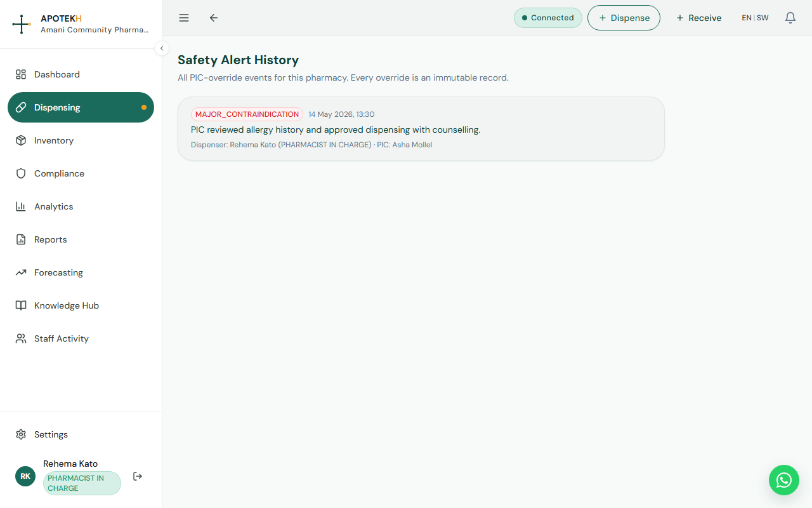

### Severity levels

The app summarizes alert severity as:

- High alerts
- Moderate alerts
- Informational alerts

Interaction and contraindication data can require a PIC PIN when the risk is high enough.

### PIC override

Who can authorize: PIC users with a valid PIC PIN, including `PHARMACIST_IN_CHARGE`, `OWNER`, or `SUPER_ADMIN` with configured PIN.

What it does:

If a major safety alert requires override, checkout is blocked until the user enters:

- Override reason
- PIC PIN

The backend rate-limits PIC PIN attempts. Current limit is 5 attempts per 15 minutes per pharmacy/user context.

The override is stored in an immutable override log with:

- Alert type
- Reason
- Dispenser/user
- PIC user
- Timestamp

Where to review: `Safety Alerts`

### Contraindication checks

The patient safety session can consider:

- Pregnancy
- Breastfeeding/lactation
- Renal impairment
- Hepatic impairment
- Allergies
- Diagnoses
- Age
- Weight

When the safety rules need missing data, the UI shows rule-triggered patient checks and asks the dispenser to capture the relevant flags.

### AI-powered counselling suggestions

The patient safety panel can show counselling suggestions based on the safety review and patient flags.

Backend support includes an `AiCounsellingCache` table. Suggestions may be generated from rule templates or cached so repeat counselling guidance is faster and more consistent.

The UI displays a `Cached` badge when cached suggestions are used.

### NCD hints

NCD hints are shown when drug and diagnosis context suggests chronic disease considerations. They help the pharmacy team remember counselling, adherence, and referral prompts during dispensing.

### Dose calculator

Where to find it: `Dispensing`

What it does:

The dose calculator is off by default and can be enabled when needed. It supports:

- Adult dose input
- Age in years
- Weight in kg
- Recommended mg/kg text
- Clark's method
- Young's method
- Weight-based working

If a pediatric patient is detected without weight, the calculator prompts staff to add weight before using dose support.

### AWaRe antibiotic flags

Where to find it: `Dispensing` medicine search and basket lines.

What it does:

The system flags `WATCH` and `RESERVE` antibiotics using WHO AWaRe / Tanzania NEMLIT context.

- `WATCH antibiotic`: warning badge
- `RESERVE antibiotic`: danger badge
- `ACCESS` antibiotics and non-antibiotics do not show the badge

This is informational only. It does not block dispensing or require PIC PIN by itself.

### Controlled drugs register

Where to find it: `Controlled Register`

Who uses it: `OWNER`, `PHARMACIST_IN_CHARGE`, `SUPER_ADMIN`

What it does:

The Controlled Register is generated from completed dispensing events. It highlights controlled and narcotic lines with:

- Reference number
- Medicine
- Drug class
- Quantity
- Batch
- Dispensed by
- Timestamp
- Payment method

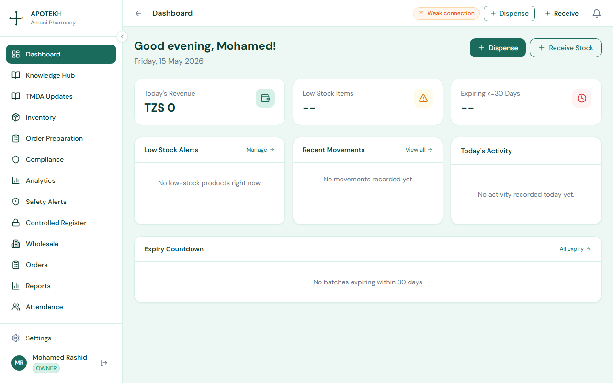

---

## 7. Patient Management

### Patient context during dispensing

Where to find it: `Dispensing`

Who uses it: dispensers, pharmacists, PICs.

What it does:

The current dispensing screen supports session-level patient/customer context for safer dispensing. Staff can record name or label, phone, age, weight, diagnoses, allergies, pregnancy, breastfeeding, renal impairment, and hepatic impairment.

The screen also supports session shortcuts and phone-based matching from the local dispensing patient store.

### Patient profiles

Backend support exists for patient profiles with:

- First name
- Last name
- Date of birth
- Gender
- Phone
- NHIF number
- Allergies
- Chronic conditions
- Notes

Current product note:

The main sidebar routes `/patients/new` and `/patients/:id` redirect to `Patient Records`, which is currently a deferred page. For demos, present patient management as partly implemented in dispensing context and planned as a fuller patient records module.

### Prescription photos and history

Where to find it: `Dispensing`

What it does:

During checkout, staff can attach a prescription photo using the device camera or image upload. Supported image types include PNG, JPEG, and WebP. Prescription photos require network connection because the file must upload during checkout.

Backend support stores prescription metadata linked to pharmacy, optional patient, dispensing event, reference number, photo path, and creator.

### NHIF claims

Where to find it: `NHIF Claims`

Status: Coming Soon / Deferred

What it does:

NHIF Claims is visible in the product roadmap and sidebar. The current page is a deferred placeholder. Backend schema support exists for claims and claim items, but the full claim submission workflow is not yet live.

Planned workflow:

1. Select patient/member.
2. Verify NHIF details.
3. Add claim items and ICD code where required.
4. Scrub missing or invalid fields.
5. Submit claim.
6. Track status: draft, submitted, approved, rejected, paid, or resubmitted.

---

## 8. Compliance & Regulatory

### Compliance dashboard

Where to find it: `Compliance`

Who uses it: `OWNER`, `PHARMACIST_IN_CHARGE`, `DISPENSER`, `SUPER_ADMIN`, and selected wholesale roles.

What it does:

Compliance Tracker turns licences, insurance, equipment checks, safety obligations, record keeping, and staff credentials into visible dated tasks.

The dashboard shows:

- Health Score
- Status breakdown: `GREEN`, `AMBER`, `RED`, `EXPIRED`
- Urgent Attention Required
- Links to Staff Credentials, Inspection Checklist, and Add Item

Offline behavior:

The compliance dashboard caches a local IndexedDB snapshot. If live data is unavailable, it can show an offline snapshot with the last synced time.

### Compliance items

Where to find it:

- `Compliance > All items`
- `Compliance > Add Item`
- `Compliance > Item Detail`

Categories include:

- `LICENCE`
- `INSURANCE`
- `EQUIPMENT`
- `STAFF_CREDENTIAL`
- `SAFETY`
- `RECORD_KEEPING`
- `OTHER`

Typical scenario:

1. Open `Compliance`.
2. Click `Add Item`.
3. Enter title, category, issuing body, expiry/due dates, renewal date, and notes.
4. Upload supporting documents where required.
5. Track status from dashboard.

### Inspection checklist generator

Where to find it: `Compliance > Inspection Checklist`

Who uses it: `OWNER`, `PHARMACIST_IN_CHARGE`, `SUPER_ADMIN`

What it does:

The TMDA Inspection Checklist page generates inspection readiness checklists from backend templates. Items can be marked:

- Pending
- Compliant
- Non-Compliant
- Not Applicable

Non-compliant items require a note. The page calculates a readiness score and supports printing or PDF download when a PDF URL exists.

Typical scenario:

1. Open `Compliance > Inspection Checklist`.
2. Click `New Checklist`.
3. Review categories and items.
4. Click each item to cycle status.
5. Add notes for non-compliant findings.
6. Print or download the checklist for inspection preparation.

### Staff credentials

Where to find it: `Compliance > Staff Credentials`

Who uses it: owners, PICs, compliance managers.

What it does:

Staff Credentials tracks professional registrations, certificates, and renewal evidence.

Fields include:

- Credential Name
- Credential Number
- Issuing Body
- Issued At
- Expires At
- Notes

### Pharmacovigilance

Where to find it: `ADR Reporting` / `/pharmacovigilance`

Status: Coming Soon / Deferred

What it does:

The current page is a deferred placeholder for Adverse Drug Reaction Reporting. The schema exists for future ADR reports, including suspected drug, brand, batch, reaction, onset, outcome, patient age/sex, seriousness, status, TMDA reference number, and submitted timestamp.

Planned use:

1. PIC opens ADR Reporting.
2. Enters suspected medicine and reaction details.
3. Saves draft.
4. Submits to TMDA when electronic integration is ready.
5. Tracks TMDA reference and submission status.

### Cold chain monitoring

Status: schema-ready, no full UI/API yet.

What it does:

Products can carry cold chain fields such as `coldChainRequired`, `storageCondition`, and Drug Catalogue flags. Backend schema includes a `ColdChainLog` table for future temperature logs with product, storage unit, temperature, excursion flag, notes, and timestamp.

For current demos, describe cold chain as a data-ready compliance feature with product-level flags already visible and temperature-log workflow planned.

---

## 9. Forecasting & Analytics

### Analytics

Where to find it: `Analytics`

Who uses it: `OWNER`, `PHARMACIST_IN_CHARGE`, `DISPENSER`, `CASHIER`, `WHOLESALE_MANAGER`, `SUPER_ADMIN` depending on permissions.

What it does:

Analytics provides operational snapshots from inventory, movements, compliance, and active modules.

Widgets include:

- Total Stock Value
- Units Dispensed
- Low / Out of Stock
- Compliance Score
- Stock Movements
- Compliance Breakdown
- Top Dispensed Products
- Expiry Risk
- Storage Conditions
- Multi-outlet Compare for Enterprise where available

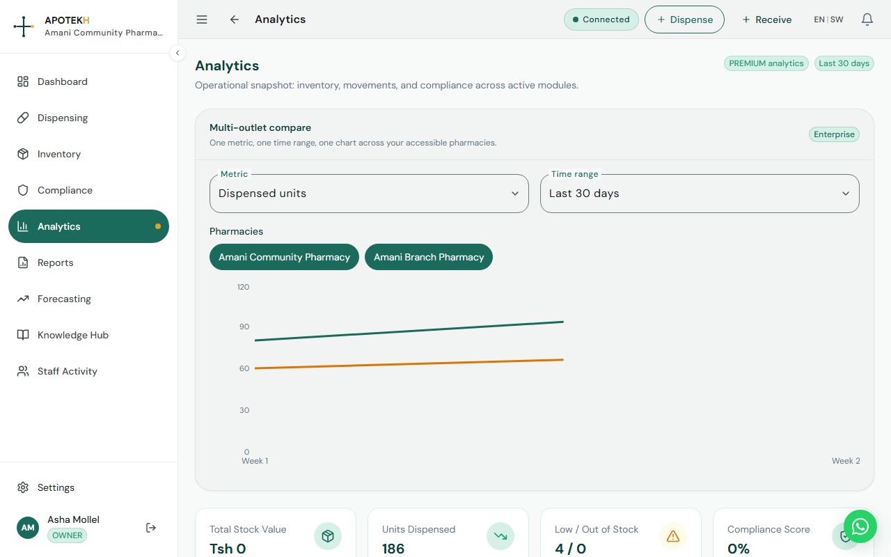

### Reports

Where to find it: `Reports`

Who uses it: owners, PICs, cashiers, wholesale managers, super admins.

What it does:

Reports focuses on financial and management reporting.

Current report cards include:

- Revenue
- Transactions
- Cohort size
- Peer Benchmark
- Custom Builder Snapshot

Peer benchmarking may show a message when data is not available yet.

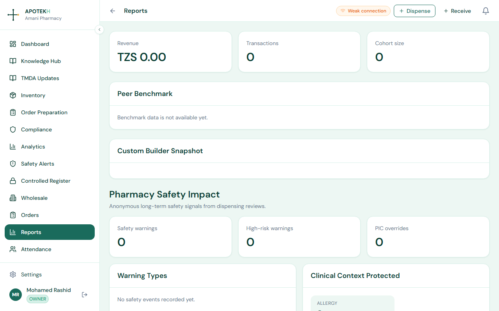

### Forecasting

Where to find it: `Forecasting`, linked from `Analytics`

Who uses it: owners, PICs, managers, investors during demos.

What it does:

Forecasting is an early preview based on deterministic methods, not opaque AI claims. It uses available stock movement history.

Forecasting views include:

- Stockout forecast
- Seasonality, Premium and above
- Dead stock ranking, Premium and above
- Regional demand insights status

Forecasting warning:

The UI states that forecasting engines are still being calibrated and figures are indicative only.

Typical scenario:

1. Open `Analytics`.
2. Click `Open forecasting workspace`.
3. Review stockout forecast by current stock, average daily demand, lead time, estimated stockout date, and at-risk value.
4. For Premium/Enterprise, review seasonality and dead-stock ranking.

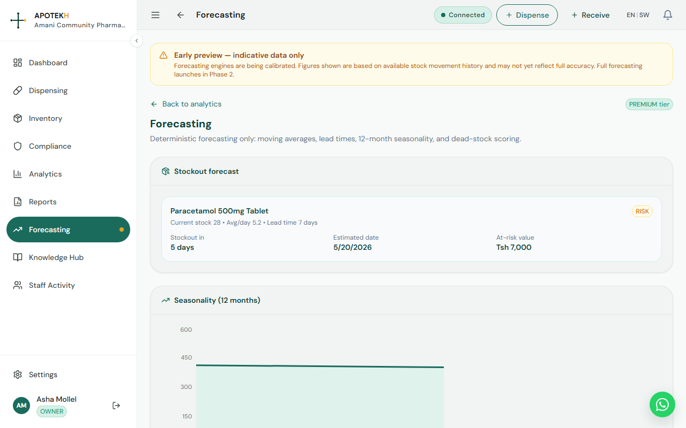

### Feature telemetry

What it does:

The backend includes feature telemetry support to understand product usage patterns and improve rollout decisions. This is primarily a platform improvement feature rather than an end-user workflow.

For investor demos, position telemetry as a product learning loop that helps APOTEKH see which workflows create adoption and where training may be needed.

---

## 10. Wholesale & B2B Operations

### Wholesale dashboard

Where to find it: `Wholesale`

Who uses it: `OWNER`, `WHOLESALE_MANAGER`, `WHOLESALE_COUNTER_STAFF`, `DELIVERY_STAFF`, `SUPER_ADMIN` depending on workflow.

What it does:

Wholesale Dashboard supports B2B distributor operations and hybrid retail/wholesale pharmacies.

Dashboard cards include:

- Catalogue lines
- Orders in view
- VAT invoices
- Open receivables
- Demand insights
- Receivables aging
- Open orders
- EFDMS invoice queue
- Credit controls

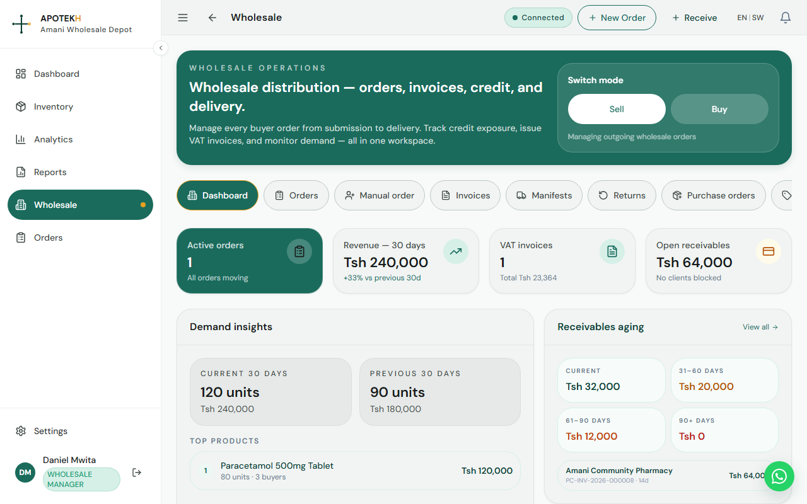

### Wholesale orders

Where to find it: `Orders` or `Wholesale > Orders`

What it does:

Wholesale Orders manages B2B order status, delivery scheduling, picking, verification, and delivery confirmation.

Common order statuses include:

- `DRAFT`
- `SUBMITTED`
- `CONFIRMED`
- `PACKED`
- `DISPATCHED`
- `DELIVERED`
- `COMPLETED`
- `DISPUTED`
- `CANCELLED`

Typical scenario:

1. Wholesale manager opens `Orders`.
2. Reviews submitted or open orders.
3. Assigns or reviews picking work.
4. Counter staff pick and verify quantities.
5. Delivery staff confirm delivery.
6. Invoice and receivables data update.

### Supplier management and purchase orders

Where to find it:

- `Inventory > Suppliers` through inventory workflows
- Wholesale supplier and purchase-order backend workflows
- `Order Preparation` for retail restocking

What it does:

Supplier records support stock intake, order preparation, wholesale purchase orders, and reorder planning. Owners can configure whether dispensers are allowed to add, edit, or remove supplier records from `Settings > Team`.

### Credit limits, invoices, and receivables

Who uses it: `OWNER`, `WHOLESALE_MANAGER`, `SUPER_ADMIN`

What it does:

Wholesale operations include:

- Client credit limits
- Outstanding balances
- Payment terms
- Blocked orders
- VAT invoices
- EFDMS status fields
- Receivables aging buckets

For investor demos, this shows APOTEKH is not only retail POS. It supports distributor-grade B2B controls.

---

## 11. Knowledge Hub & Professional Development

### Knowledge Hub

Where to find it: `Knowledge Hub`

Who uses it: all pharmacy users and sales teams during demos.

What it does:

Knowledge Hub provides searchable pharmacy content:

- Articles
- Bulletins
- Publications
- Weekly digest subscription

Article categories include:

- `DRUG_SAFETY`
- `REGULATORY`
- `CLINICAL`
- `BUSINESS`
- `TECHNOLOGY`
- `CPD`
- `GENERAL`

Typical scenario:

1. Open `Knowledge Hub`.
2. Search articles by topic.
3. Filter by category.
4. Open an article.
5. Review bulletins or publications.
6. Subscribe to weekly digest.

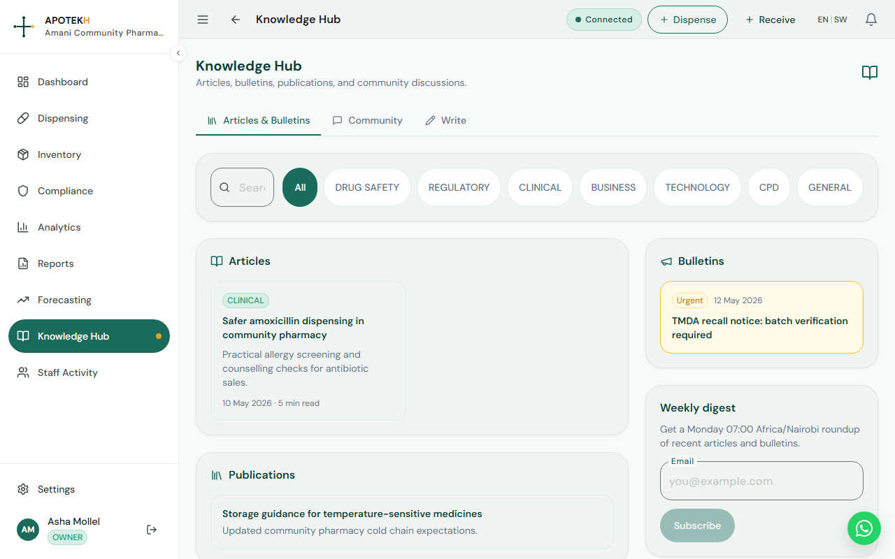

### TMDA Updates

Where to find it: `TMDA Updates`

Who uses it: PICs, owners, compliance-focused staff.

What it does:

TMDA Updates is a dedicated regulatory update area. Use it in demos to show that APOTEKH treats regulatory information as a daily pharmacy workflow, not a separate spreadsheet or WhatsApp thread.

### CPD Tracker

Where to find it: `CPD Tracker` or `/cpd`

Status: Coming Soon / Phase 2

What it does:

CPD Tracker is a planned Phase 2 feature for recording professional learning activities and CPD points. The current page is a placeholder. Full CPD tracking, premium courses, and certificate verification will be released in a future update.

### PC-Accredited CPD

Where to find it: `PC-Accredited CPD`

Status: Coming Soon / Deferred

What it does:

The current page is a deferred placeholder for accredited CPD recognition. The internal CPD Tracker exists, but official accreditation is not presented as fully live.

---

## 12. Team & Pharmacy Management

### Profile

Where to find it: `Settings > Profile`

Who uses it: all users.

What it does:

Profile shows account and pharmacy information:

- First Name
- Last Name
- Email
- PC Registration
- Pharmacy
- Region
- Current role
- Memberships, if the user belongs to multiple pharmacies
- Password change form

### Team Management

Where to find it: `Settings > Team`

Who uses it: `OWNER`, `PHARMACIST_IN_CHARGE`, `SUPER_ADMIN`

What it does:

Team Management lets authorized users view team members, invite staff, assign roles, and update role assignments.

Invite roles include:

- Pharmacist In-Charge
- Dispenser
- Cashier
- Wholesale Manager
- Wholesale Counter Staff
- Delivery Staff

Typical scenario:

1. Open `Settings > Team`.
2. Click `Invite Member`.
3. Enter first name, last name, email, temporary password, and role.
4. Share temporary password securely with the new staff member.
5. Staff member is prompted to change password on first login.

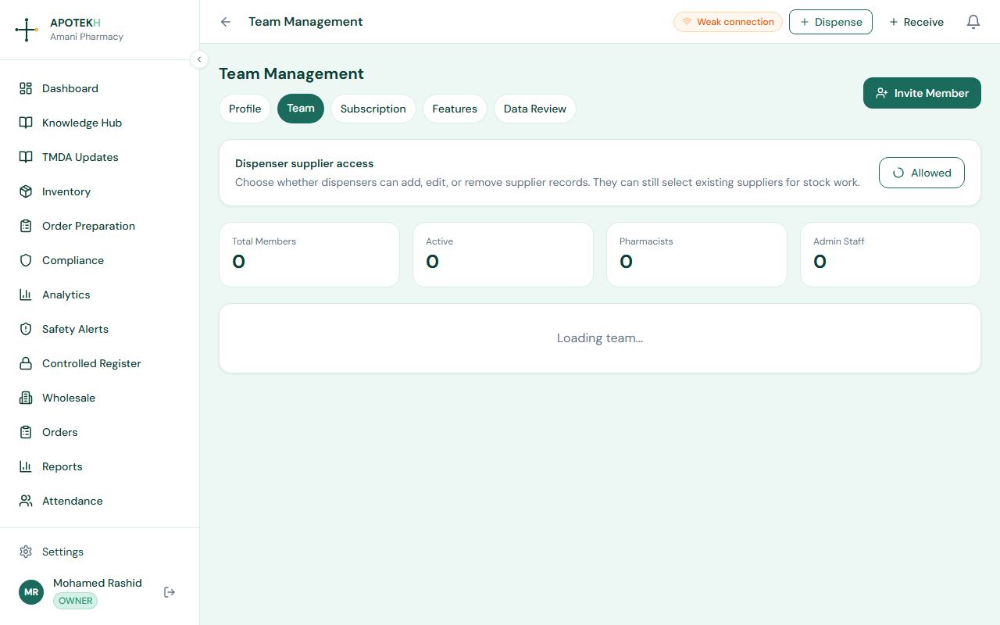

### PIC PIN

The PIC PIN is used for clinical override workflows. The backend verifies PIC PINs against active PIC/owner/super-admin users with stored PIN hashes and applies rate limiting. If a pharmacy uses patient safety overrides, PIC PIN setup should be completed during onboarding.

### Dispenser supplier access

Where to find it: `Settings > Team`

Who uses it: `OWNER`, `SUPER_ADMIN`

What it does:

Owners can choose whether dispensers can add, edit, or remove supplier records. Dispensers can still select existing suppliers for stock work.

### Pharmacy memberships and multi-pharmacy support

Where to find it:

- `/select-pharmacy`
- Top bar outlet selector
- `Settings > Profile`

What it does:

Users can belong to multiple pharmacies through pharmacy memberships. The active outlet controls access, tier, analytics, and reporting scope.

Typical scenario:

1. A user logs in.
2. If they belong to multiple pharmacies, they choose an outlet.
3. The device remembers the selected outlet.
4. The top bar lets them switch outlets later.

### Payment method configuration

Where to find it: `Settings > Subscription`

Who uses it: `OWNER`, `SUPER_ADMIN`

What it does:

Owners configure mobile money methods for dispensing. Cash always remains enabled.

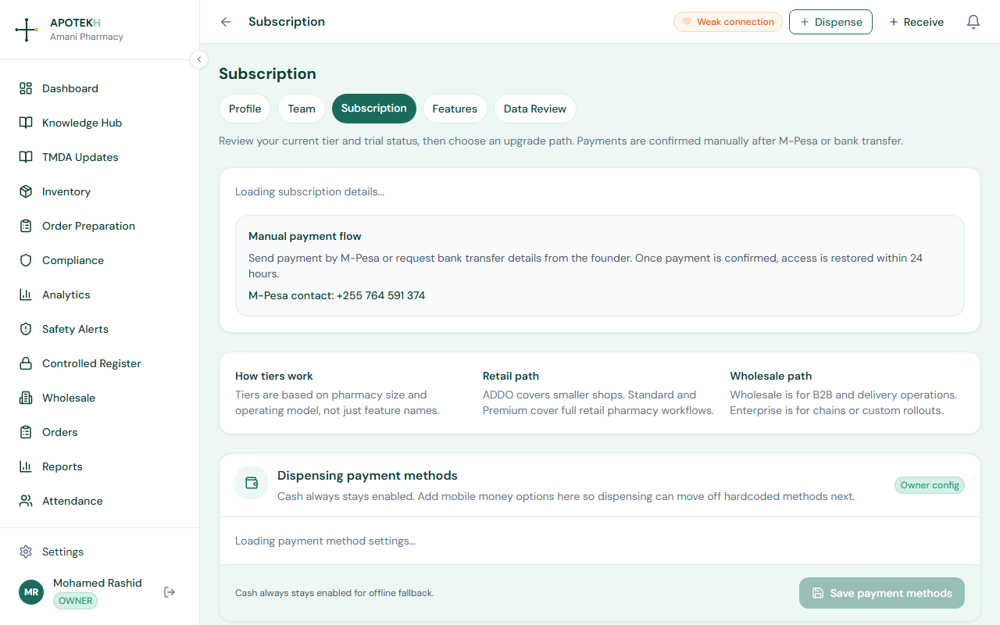

---

## 13. Offline Mode Deep Dive

### How offline mode works

APOTEKH uses a service worker, browser cache, and IndexedDB to keep key workflows usable during unstable connectivity.

Main pieces:

- Service worker caches the app shell.
- GET API reads are cached with a network-first strategy.
- Writes are handled by the app-level IndexedDB queue.
- Connectivity status appears in the top bar.
- Queued writes sync when the browser comes back online.

### IndexedDB storage

Main offline database:

- Database: `pharmaconnect-offline`
- Store: `writeQueue`
- Store: `inventoryDeltas`
- Retention: 7 days

Compliance cache database:

- Database: `pharmaconnect-compliance-cache`
- Store: `dashboard`

### 7-day local buffer

Offline writes and inventory deltas expire after 7 days. If they are not synced within that period, they are purged and the app shows a warning such as queued writes expired after 7 days and were removed.

Sales demo wording:

"APOTEKH is designed for real pharmacy connectivity conditions. It keeps work moving locally for up to 7 days and syncs automatically when internet returns."

### What can be queued offline?

Current queued workflows include:

- Stock intake batches
- Dispensing sessions without prescription photo upload
- General inventory writes that use the offline write queue

### What happens on reconnect?

1. Browser fires online event.
2. `useOfflineSync` starts flush.
3. Expired writes are purged.
4. Writes are submitted in created order.
5. Successful writes are removed from queue.
6. Failed server rejections may create conflict records.
7. Remaining writes keep last error and attempt count.
8. Pending sync count updates in the top bar.

### Conflict resolution

Where to find it: `Sync Conflicts`

What it does:

Conflicts preserve the local payload and server payload so a PIC, owner, or super admin can review what happened and decide how to resolve it.

Typical conflict scenario:

1. A stock batch is queued offline.
2. The server later rejects it because data is invalid or stale.
3. APOTEKH logs an offline sync conflict.
4. The manager opens `Sync Conflicts`.
5. They review and resolve it.

### Offline limitations

- Offline mode is not a full local copy of the cloud database.
- Fresh server-only data may not be available until the device reconnects.
- Prescription photos require online checkout.
- Safety checks depend on server responses and cached state.
- Staff should sync as soon as connectivity is available.

---

## 14. Subscription & Billing

### Plans

Where to find it: `Settings > Subscription`

Who uses it: `OWNER`, `SUPER_ADMIN`, sales team.

Known plan/tier names:

- `ADDO`
- `BASIC`
- `STANDARD`
- `PREMIUM`
- `WHOLESALE`
- `ENTERPRISE`

Current pricing:

**Retail tiers:**

| Plan | Monthly price | Annual price | Included scale |
|---|---:|---:|---|
| ADDO | Tsh 20,000 | Tsh 200,000 | 1 outlet, 3 users |
| BASIC | Tsh 39,000 | Tsh 390,000 | 2 outlets, 5 users |
| STANDARD | Tsh 55,000 | Tsh 550,000 | 3 outlets, 10 users |
| PREMIUM | Tsh 75,000 | Tsh 750,000 | 5 outlets, 20 users |

**Wholesale / distributor tiers:**

| Plan | Monthly price | Annual price | Included scale |
|---|---:|---:|---|
| WHOLESALE | Tsh 100,000 | Tsh 1,000,000 | 1 wholesale outlet, 10 users + delivery staff |
| ENTERPRISE | Custom | Custom | 6+ outlets, unlimited users |

Annual billing is 10x the monthly price. Enterprise pricing is negotiated for custom rollout, reporting, and governance needs.

### Billing cycle

The platform supports:

- `MONTHLY`
- `ANNUAL`

Subscription records include:

- Current tier
- Billing cycle
- Trial status
- Trial countdown
- Account status: `TRIAL`, `ACTIVE`, `SUSPENDED`, `CANCELLED`

### Manual payment flow

The current Subscription page explains manual payment confirmation. Payment may be handled by mobile money or bank transfer, then access is confirmed by the APOTEKH team.

The app states access is restored within 24 hours after payment confirmation.

### Upgrading and downgrading

Where to find it: `Settings > Subscription`

Who uses it: `OWNER`, `SUPER_ADMIN`

Current flow:

1. Owner reviews current tier and available plan names.
2. Owner contacts the APOTEKH team or founder through the listed contact flow.
3. APOTEKH confirms the selected current plan or enterprise quote.
4. Team updates subscription status/tier.

### Founder controls

Where to find it: `Founder`

Who uses it: `SUPER_ADMIN`

What it does:

Founder Dashboard provides platform-level oversight for registrations, trials, suspensions, owner verification, subscription tiers, platform activity, and recent safety overrides.

Founder controls include:

- Total pharmacies
- Active pharmacies
- Total users
- Total dispensings
- Subscription tier breakdown
- Platform activity
- Recent PIC override activity
- Trial extension controls
- Suspend/reactivate registration controls
- Verify owner controls

---

## 15. Frequently Asked Questions

### Is APOTEKH only a point-of-sale system?

No. It includes POS-style dispensing, but it also covers inventory, batch tracking, expiry risk, compliance, safety checks, Knowledge Hub, CPD, analytics, wholesale operations, and offline sync.

### Can the pharmacy work without internet?

Yes, for supported workflows. Stock intake and core dispensing can be queued locally for up to 7 days. The app syncs automatically when internet returns.

### Can prescription photos be captured offline?

No. Prescription photos require online checkout because the image file must upload to the backend.

### Does APOTEKH choose the clinical decision for the pharmacist?

No. APOTEKH surfaces alerts, counselling prompts, and safety context. The pharmacist or PIC remains responsible for the professional decision. High-risk overrides require a reason and PIC PIN.

### What is the difference between Products and Drug Catalogue?

Products are your pharmacy's local stock items. Drug Catalogue is the system-wide reference list used for cleaner names, TMDA/NEMLIT context, storage flags, and product matching.

### What is FEFO?

FEFO means First Expiry, First Out. It helps staff use batches with the earliest expiry first, reducing waste and patient risk.

### Can a dispenser change stock directly?

Dispensers can perform allowed stock work, but stock adjustment corrections are handled through suggestions and approval. Owners, PICs, or super admins review and approve changes.

### Are NHIF claims live?

NHIF Claims is visible in the roadmap and has backend schema support, but the current user-facing page is deferred. Treat it as Coming Soon until the full claims workflow is released.

### Is ADR reporting live?

No. ADR Reporting / Pharmacovigilance currently shows a Coming Soon page. The schema is ready, but TMDA electronic reporting integration is required before submission is live.

### Does APOTEKH support wholesale distributors?

Yes. Wholesale workflows include a wholesale dashboard, catalogue lines, B2B orders, invoices, receivables, credit controls, demand insights, picking, verification, and delivery confirmation.

### Does APOTEKH track CPD?

CPD tracking is a planned Phase 2 feature. The current sidebar shows a Coming Soon placeholder. PC-Accredited CPD is a separate deferred feature requiring a Pharmacy Council MOU.

### Can owners manage multiple pharmacies?

Yes. Users can have multiple pharmacy memberships and switch the active outlet. The active outlet controls role, tier, analytics, and reporting scope.

### What should sales staff say about pricing?

Use the current pricing matrix: ADDO Tsh 20,000/month, BASIC Tsh 39,000/month, STANDARD Tsh 55,000/month, PREMIUM Tsh 75,000/month, WHOLESALE Tsh 100,000/month, and ENTERPRISE custom. Annual billing is 10x monthly pricing.

### What makes APOTEKH Tanzania-specific?

It includes Tanzanian regions, pharmacy licence context, TMDA registration fields, NEMLIT and MSD catalogue orientation, AWaRe antibiotic flags, Africa/Nairobi timezone defaults, NHIF roadmap, TMDA updates, ADR roadmap, and compliance workflows designed around pharmacy inspection readiness.

### What should investors notice?

APOTEKH is deeper than a generic POS. It combines regulated pharmacy operations, offline-first resilience, clinical safety, Tanzania-specific master data, B2B wholesale workflows, professional learning, compliance evidence, and founder-level platform controls.

---

## Appendix A: Quick Demo Script for Sales

1. Start at the public website and explain the product promise.
2. Log in and show the Dashboard.
3. Open Inventory and show low stock, expiry, products, and batches.
4. Open Receive Stock and demonstrate barcode scanner/manual barcode entry.
5. Open Dispensing, add a product, show patient safety panel and payment flow.
6. Show Safety Alerts and Controlled Register.
7. Open Compliance and generate or review inspection checklist.
8. Open Analytics and Forecasting.
9. Open Wholesale dashboard for B2B depth.
10. Open Knowledge Hub and CPD Tracker.
11. Open Settings for team, subscription, and payment method configuration.
12. Mention offline mode and show top bar sync status.
13. For investor demos, finish with Founder Dashboard and the public Investors page.

## Appendix B: Screenshot Checklist

- [Screenshot: Public website homepage hero]
- [Screenshot: Registration page]
- [Screenshot: Trial confirmation page]
- [Screenshot: Dashboard]
- [Screenshot: Inventory dashboard]
- [Screenshot: Products list]
- [Screenshot: Add Product form]
- [Screenshot: Drug Catalogue]
- [Screenshot: Receive Stock with barcode scanner]
- [Screenshot: Batch Manager]
- [Screenshot: Stock Adjustment Approval]
- [Screenshot: Order Preparation]
- [Screenshot: Dispensing screen]
- [Screenshot: Patient safety panel with PIC override]
- [Screenshot: Safety Alert History]
- [Screenshot: Controlled Register]
- [Screenshot: Compliance Tracker]
- [Screenshot: TMDA Inspection Checklist]
- [Screenshot: Staff Credentials]
- [Screenshot: Analytics]
- [Screenshot: Forecasting]
- [Screenshot: Wholesale Dashboard]
- [Screenshot: Knowledge Hub]
- [Screenshot: CPD Tracker]
- [Screenshot: Team Management]
- [Screenshot: Subscription page]
- [Screenshot: Founder Dashboard]
